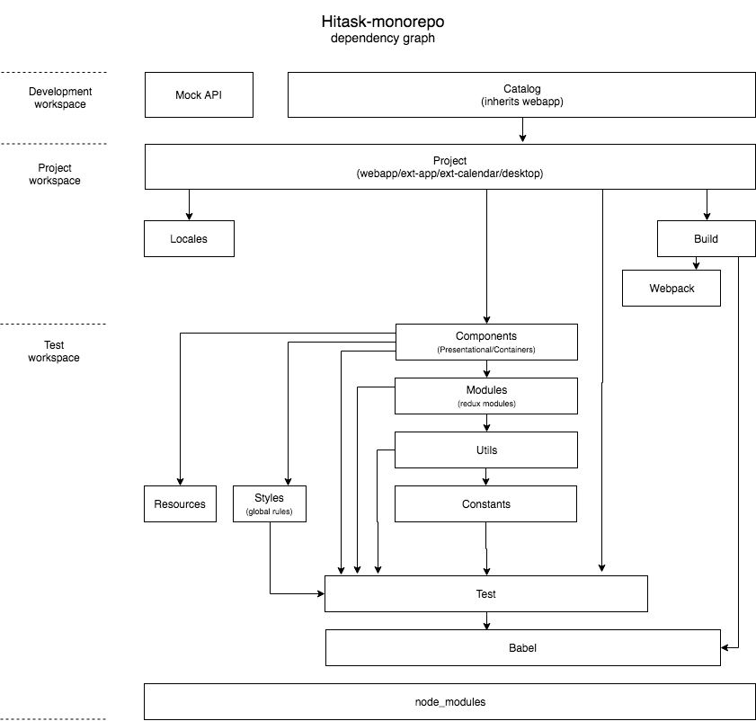

# Repository structure

This codebase has monorepo structure - it consists of several npm packages, connected with dependencies. There are three types of packages - project packages (webapp, ext-app, ext-calendar, desktop), development packages (catalog, mock-api) and shared packages (other). We use [lerna](https://lernajs.io/) tool for package management. Here is a dependency graph:

## 1 Packages

Project packages:

* [desktop](packages/desktop/README.md)
* [ext-app](packages/ext-app/README.md)
* [ext-calendar](packages/ext-calendar/README.md)
* [webapp](packages/webapp/README.md)

Development packages:

* [catalog](packages/catalog/README.md)
* [mock-api](packages/mock-api/README.md)

Shared packages:

* [components](packages/components/README.md)
* [modules](packages/modules/README.md)
* [utils](packages/utils/README.md)
* [constants](packages/constants/README.md)
* [styles](packages/styles/README.md)
* [locales](packages/locales/README.md)
* [resources](packages/resources/README.md)
* [test](packages/test/README.md)
* [babel](packages/babel/README.md)
* [webpack](packages/webpack/README.md)
* [build](packages/build/README.md)
* [ext-build](packages/ext-build/README.md)

## 2 Workspaces

When application is split into modularized packages, we can combine them into different workspaces, like bricks blocks, to install and work only with functionality that we need for particular purpose - testing, project building or development. [Yarn workspaces](https://yarnpkg.com/lang/en/docs/workspaces/) helps with it

### Test workspace

Includes following packages:

* `components`
* **`modules`**
* **`utils`**
* `constants`
* `styles`
* `resources`
* `test`
* `babel`

All packages are covered with linting tests. Bold packages are covered with unit tests. Reed more about testing process in [TEST.md](TEST.md). This workspace is used in CI test jobs

### Webapp workspace

Includes test workspace plus following packages:

* `locales`
* `webpack`
* `build`
* `webapp`

This workspace is used for webapp build & release process

### Ext-app workspace

Includes test workspace plus following packages:

* `locales`
* `webpack`
* `build`
* `ext-app`

### Ext-calendar workspace

Includes test workspace plus following packages:

* `locales`
* `webpack`
* `build`
* `ext-calendar`

### Desktop workspace

Includes test workspace plus following packages:

* `locales`
* `webpack`
* `build`
* `desktop`

### Development workspace

Includes all available packages and considered to be default.

## 3 Adding a dependency

* Any new dependencies must be approved with manager or lead developer.
* To add a new dependency add it to every package where it is used
